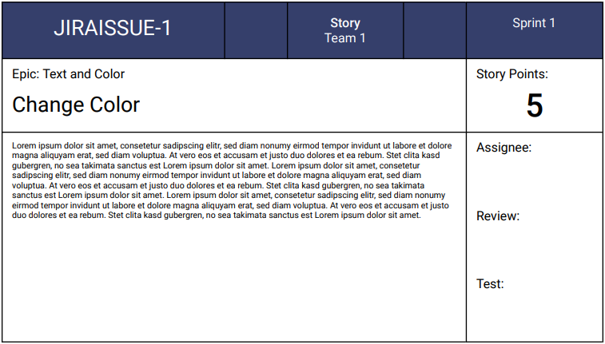

# Arvato Agile Card Generator #
by André Hanel
in cooperation with Arvato Bertelsmann and Esprit

Simple Tool to create beautiful Jira Agile Cards in DIN A5 format build on [Meteor](https://www.meteor.com/)

## Used Technologies

- [Docker](https://www.docker.com/)
- [Meteor](https://www.meteor.com/)
- [Mongo DB](https://www.mongodb.com)
- [PDF Make](http://pdfmake.org)
- [Handlebars](https://handlebarsjs.com/)

## Getting Started

### Prerequisites

- [Docker](https://www.docker.com/) or [Meteor](https://www.meteor.com/) to start the application
- [Mongo DB](https://www.mongodb.com) instance if Docker is used
- Web Browser

#### Config

If you start without Docker you have to set some environment variables first.

| Name          | Description                                            |
| ------------- | ------------------------------------------------------ |
| JIRA_URL      | URL to your Jira instance, needed for link building    |
| JIRA_API_URL  | URL to the Jira rest API                               |
| JIRA_USERNAME | Jira user used for Rest API calls                      |
| JIRA_PASSWORD | Password for Jira user                                 |
| PROXY_URL     | Proxy Url if behind proxy server
| [ROOT_URL](https://docs.meteor.com/environment-variables.html#ROOT-URL) (optional)    | Used to generate URLs to your application |
| [MONGO_URL](https://docs.meteor.com/environment-variables.html#MONGO-URL) (optional)  | MongoDB server URL                        |

### Start with Docker

The Agile Card Generator is ready for Docker.
You don't have to checkout this repository.
Just run the following command:

    docker run -p 3000:3000 \
        -e MONGO_URL=mongodb://example.org/mycollection \
        -e JIRA_URL=https://jira.example.org \
        -e JIRA_API_URL=https://jira.example.org/rest/agile/1.0 \
        -e JIRA_USERNAME=user \
        -e JIRA_PASSWORD=secret \
        anh4n/agile-card-generator:latest

If you want to start it locally you can also use docker-compose.
Create a `.env` file in the root directory and set the needed environment variables.
Then run the following commands:

    ./build/build.sh
    docker-compose up

### Start with Meteor

    meteor npm install
    meteor run

## Usage ##

Open [http://localhost:3000](http://localhost:3000) or your `ROOT_URL` (if set) in a web browser

### 1. Create/Edit Teams

First you have to add your Teams. Click on `Edit Teams` and add a new record or edit an extisting one.

### 2. Sprints

After creating your teams, select a team and the sprints of this team will be shown.

### 3. Issues

Select a sprint and the corresponding issues will be listet.

### 4. Templates ###

You can edit an issue template by clicking on `Edit Templates`.
Templates are created with [PDF Make](https://pdfmake.github.io/docs/).
In the templates you can use [Handlebars](https://handlebarsjs.com/) expressions.

There are some predefined Handlebars expressions and helpers:

#### Variables

| Name               | Description                      |
| ------------------ | -------------------------------- |
| ISSUEKEY           | issue key                        |
| SUMMARY            | issue summary                    |
| ISSUETYPE          | issue type. e.g. Story or Bug    |
| COMPONENTS         | issue components                 |
| SPRINT             | sprint name                      |
| STORYPOINTS        | issue story points               |
| TEAMNAME           | name of the selected team        |
| ISSUETYPESTYLE     | style used for template coloring |
| DESCRIPTION        | issue description                |
| STORY_OR_EPIC_TEXT | when issue is a story it contains the epic or when issue is a technical task it contains the parent story key and summary|

#### Helper

**getTruncatedText(text, maxLength)**

trucate text

Example:

    {{getTruncatedText DESCRIPTION 350}}

| Parameter  | Description                | Type    |
| ---------- | -------------------------- | ------- |
| text       | the text to be shortened   | string  |
| maxLength  | maximum length of the text | integer |
